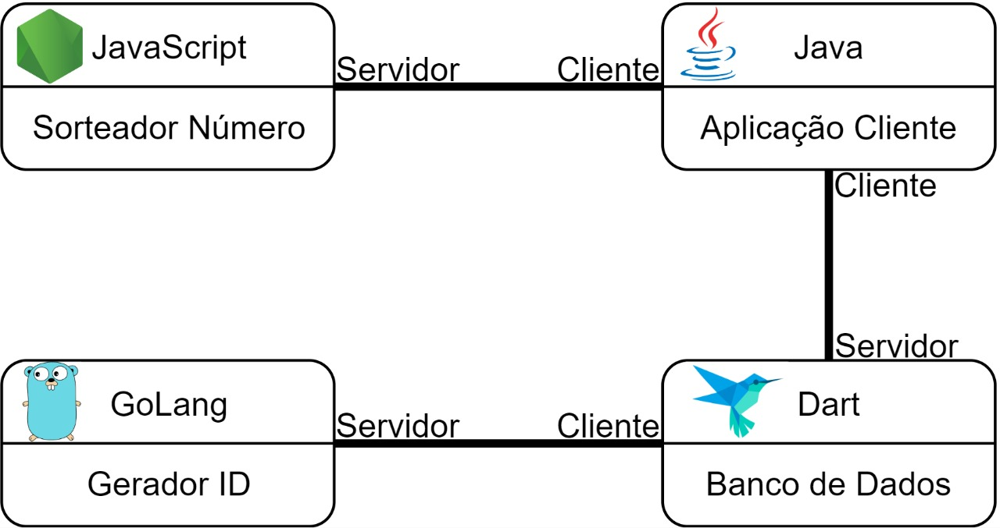

# Estudo Prático da Interoperabilidade de API's com gRPC

Nós construímos um sistema distribuído de microsserviços fazendo a interoperabilidade de APIs implementadas em quatro linguagens de programação diferentes (`Golang`, `Dart`, `Java` e `Javacript`), utilizando o gRPC para a comunicação entre os sistemas de APIs.

## Apresentação

Este foi o nosso Trabalho de Conclusão do Curso _Análise e Desenvolvimento de Sistema_ apresentado à Fatec de São José de Rio Preto/SP em junho de 2022. Nós estávamos interessandos em compreender a tecnologia do gRPC, um novo estilo arquitetural, mais rápido e eficiente, com menores _payload_, tráfego e latência, bidirecional e nativamente poliglota. 

Para "sentirmos" como se dá a comunicação de sistemas distribuídos no gRPC, nós fizemos quatro API's escritas em linguagens de programação diferentes conversarem entre si. Duas delas são mais recentes, `Golang` e `Dart`, e duas já a bastante tempo no mercado, `JavaScript` e `Java`. O que a aplicação faz em si é bem simples, no entanto, o nosso foco está na comunicação, na interoperabilidade poliglota de API's oferecida pelo gRPC.

Na Figura 1 vemos a essência da arquitetura implementada. A fábula é a seguinte: a aplicação Java é um _head hunter_, um caça-talentos que precisa fornecer uma lista de 10 programadores a uma empresa que irá desenvolver um novo projeto. A aplicação cliente Java possui internamente uma lista de 51 contatos para selecionar os 10 necessários ao projeto. A seleção está automatizada para selecionar os 10 amostrados aleatoriamente da lista interna de 51. Nada usual na vida real, mas foi a estória que criamos para contextualizar nossos testes. 

<br>
_Figura 1: Arquitetura implementada_

Para saber qual programador selecionar, o cliente Java consome uma API que oferece o serviço de sortear números inteiros dentro dos limites de um intervalo. Para tanto, a aplicação Java fornece um intervalo de 0 a 50 à API JavaScript e fica fazendo chamadas remotas ao servidor NodeJS até preencher a quantidade desejada. 

Depois, o Java precisa persistir os programadores selecionados em um banco de dados para que a empresa possa consultar o seu time de desenvolvedores. Uma API implementada em Dart fará a emulação de um banco de dados (_mock_). Dart oferece um serviço de API contendo todos os métodos das operações elementares de um banco de dados: criar, atualizar, buscar por id, listar todos e apagar. O serviço Dart salva os dados apenas em memória. 

Quando inserimos dados em um banco relacional, usualmente criamos um número sequencial para o id. Dart é o servidor de banco de dados do Java, entretanto, a fim de testarmos a comunicação entre APIs, fizemos a API Dart por sua vez ser cliente de outra API, escrita em Golang. A API Golang faz o papel de gerador de chave primária, fornecendo números sequências a cada chamada remota para que o Dart possa usá-los como identificador único da entidade Programador, cuja aplicação Java lhe solicitou para salvar no banco.<br>
Dessa forma, temos quatro sistemas implementados em linguagens distintas se comunicando, fornecendo e consumindo serviços de API com o gRPC.

## Execução

O cliente principal, o maior consumidor de microserviços é o Java, mas é totalmente dependente dos outros serviços. E cada tem seu próprio ambiente de excecução, seu próprio servidor. Sendo assim, nós vamos criar um diretório para cada linguagem de programação. É preciso ter em mente que cada diretório é como se fosse um repositório, logo, cada um deles terá o seu README.md com as instruções e comandos de execução no terminal. JavaScript e Go não possuem dependência, mas Dart depende que o serviço Go esteja no ar, e o Java depende de todos eles, sendo assim, nós faremos a seguinte sequencia:

1. JavaScript
2. Goulang
3. Dart
4. Java

Nós estamos utilizando no momento o [`Pop!_OS 22.04 LTS`](https://pop.system76.com/), uma ditribuição linux baseada no Debian. Nela estamos utilizando um gerenciador de pacotes de linguagens chamado ASDF. Ele é como o npm do nodeJS, mas a vantagem dele é que podemos controlar o versionamente global, ou de apenas uma pasta local. Depois de instalado o asdf é só instalar o plugin específico da linguagem que quer versionar e pronto; qualquer linguagem de programação em um único gerenciador. A documentação é tranquila, confira [Getting Started](https://asdf-vm.com/guide/getting-started.html) para instalação do core e dos plugins e [Versions](https://asdf-vm.com/manage/versions.html) para ver como é simples fazer o controle de versionamento.

Peço desculpas aos usuários Windows por não oferecer orientações em seu sistema operacional. As instalações do Windows geralmente são até mais simples, aquela conhecida sequência _Next_,_Next_,..._Done._ Acredito que apenas o início será diferente, depois os comandos CLI da linguagem serão os mesmos. 

Começaremos criando a pasta geral tcc_grpc e dentro dela a pasta que abrigará o Javascript:

```sh
mkdir tcc_grpc;
mkdir js_grpc;
cd js_grpc;

```

### Gerenciador de pacotes ASDF


