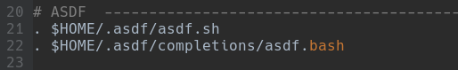

# Estudo da Interoperabilidade de API's com gRPC

Nós construímos um sistema distribuído de microsserviços fazendo a interoperabilidade de APIs implementadas em quatro linguagens de programação diferentes (`Golang`, `Dart`, `Java` e `Javacript`), utilizando o gRPC para a comunicação entre os sistemas de APIs.

---

## Apresentação

Este foi o nosso Trabalho de Conclusão do Curso _Análise e Desenvolvimento de Sistema_ apresentado à Fatec de São José de Rio Preto/SP em junho de 2022. Nós estávamos interessandos em compreender a tecnologia do gRPC, um novo estilo arquitetural, mais rápido e eficiente, com menores _payload_, tráfego e latência, bidirecional e nativamente poliglota. 

Para "sentirmos" como se dá a comunicação de sistemas distribuídos no gRPC, nós fizemos quatro API's escritas em linguagens de programação diferentes conversarem entre si. Duas delas são mais recentes, _Golang_ e _Dart_, e duas já a bastante tempo no mercado, _JavaScript_ e _Java_. O que a aplicação faz em si é bem simples, no entanto, o nosso foco está na comunicação, na interoperabilidade poliglota de API's oferecida pelo gRPC.

Na Figura 1 vemos a essência da arquitetura implementada. A fábula é a seguinte: a aplicação _Java_ é um _head hunter_, um caça-talentos que precisa fornecer uma lista de 10 programadores a uma empresa que irá desenvolver um novo projeto. O _Java_ possui internamente uma lista de 51 contatos para selecionar os 10 necessários ao projeto. A seleção está automatizada para selecionar os 10 amostrados aleatoriamente da lista interna de 51. Nada usual na vida real, mas foi a estória que criamos para contextualizar nossos testes. 

<br>
_Figura 1: Arquitetura implementada_

Para saber qual programador selecionar, o cliente Java consome uma API que oferece o serviço de sortear números inteiros dentro dos limites de um intervalo. Para tanto, a aplicação _Java_ fornece um intervalo de 0 a 50 à API _JavaScript_ e fica fazendo chamadas remotas ao servidor _NodeJS_ até preencher a quantidade desejada. 

Depois, o _Java_ precisa persistir os programadores selecionados em um banco de dados para que a empresa possa consultar o seu time de desenvolvedores. Uma API implementada em _Dart_ fará a emulação de um banco de dados (_mock_). _Dart_ oferece um serviço de API contendo todos os métodos das operações elementares de um banco de dados: criar, atualizar, buscar por id, listar todos e apagar. O serviço _Dart_ salva os dados apenas em memória. 

Quando inserimos dados em um banco relacional, usualmente criamos um número sequencial para o id. _Dart_ é o servidor de banco de dados do _Java_, entretanto, a fim de testarmos a comunicação entre APIs, fizemos a API _Dart_ por sua vez ser cliente de outra API, escrita em _Golang_. A API _Golang_ faz o papel de gerador de chave primária, fornecendo números sequências a cada chamada remota para que o _Dart_ possa usá-los como identificador único da entidade Programador, cuja aplicação _Java_ lhe solicitou para salvar no banco.<br>
Dessa forma, temos quatro sistemas implementados em linguagens distintas se comunicando, fornecendo e consumindo serviços de API com o gRPC.

---

### Execução

O cliente principal, o maior consumidor de microserviços é o _Java_, mas é totalmente dependente dos outros serviços. E cada API tem seu próprio ambiente de excecução, seu próprio servidor. Sendo assim, nós vamos criar um diretório para cada linguagem de programação. É preciso ter em mente que cada diretório é como se fosse um repositório, logo, cada um deles terá o seu README.md com as instruções e comandos de execução no terminal. JavaScript e Go não possuem dependência, mas Dart depende que o serviço Go esteja no ar, e o Java depende de todos eles, sendo assim, nós faremos os "sub-repositórios" na seguinte sequência:

1. [JavaScript](https://github.com/earmarques/tcc_grpc/tree/main/js_grpc)
2. Golang
3. Dart
4. Java

Nos README.md's dos sub-repositórios haverá apenas as instruções para subir o servidor e alguns testes. Explicações mais detalhes do que cada trecho do código faz o leitor pode consultar a [Wiki do projeto](https://github.com/earmarques/tcc_grpc/wiki), onde temos uma explicação mais abrangente e integrada. Se o leitor estiver interessado no gRPC em apenas uma das linguagens de programação, pode ir até o sub-repositório que as instruções ali bastam para fazer o gRPC funcionar.

Nós estamos utilizando no momento o [`Pop!_OS 22.04 LTS`](https://pop.system76.com/), uma ditribuição linux baseada no _Debian_. Nela estamos utilizando uma ferramenta CLI de gerenciamento de ambiente de execução chamado **`asdf`**. Com ela podemos controlar o versionamente global (qualquer diretório) ou local (apenas um diretório) de praticamente todas as linguagens de programação existentes. Depois de instalado o _core_ do _asdf_ é só instalar o _plugin_ específico da linguagem que quer versionar e pronto; qualquer linguagem de programação em um único gerenciador. A documentação é tranquila, confira [Getting Started](https://asdf-vm.com/guide/getting-started.html) para instalação do _core_ e dos _plugins_, e [Versions](https://asdf-vm.com/manage/versions.html) para ver como é simples fazer o controle de versionamento.

Peço desculpas aos usuários _Windows_ por não oferecer orientações em seu sistema operacional. As instalações do _Windows_ geralmente são até mais simples, aquela conhecida sequência _Next_, _Next_, ..., _Done._ Acredito que apenas o início será diferente, depois os comandos CLI da linguagem serão os mesmos. 

---

#### Gerenciador asdf

O essêncial para instalação em distros baseado em _Debian_ como o _Ubuntu_, está a seguir; para mais detalhes e outras distros consulte a documentação.

##### 1. Instalar as dependência

```
sudo apt install curl git
```

##### 2. Baixar o asdf

Melhor forma é clonar o repositório usando o git instalado no passo 1.

```
git clone https://github.com/asdf-vm/asdf.git ~/.asdf --branch v0.10.2
```

##### 3. Instalar o asdf

Edite o arquivo ~/.bashrc e adicione as duas linhas abaixo ao final do arquivo:

```
. $HOME/.asdf/asdf.sh
. $HOME/.asdf/completions/asdf.bash
```

Deve ficar assim:

<br>
_Figura 2: Instalação do asdf - adcionar duas linhas ao ~/.bashrc_

É só isso, o `core` do _asdf_ já está pronto, a seguir viria **4.Instalar plugin** e **5. Instalar a versão** da ferramenta desejada, mas isso faremos dentro do diretório raiz de cada linguagem.  Abrir um novo terminal para que as novas configurações do `.bashrc` sejam carregadas e recarregá-lo no mesmo terminal com o comando:

```
source ~/.bashrc
```
Começaremos criando a pasta geral tcc_grpc e dentro dela a pasta que abrigará a API _Javascript_. 

```
mkdir -p tcc_grpc/js_grpc; cd tcc_grpc/js_grpc;
```
Agora convidamos o leitor para ir até o sub-repositório do [_JavaScript_](js_grpc/README.md) para ver como é simples configurar o o gRPC no _NodeJS_.


