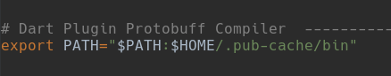
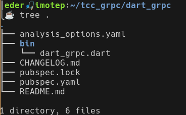
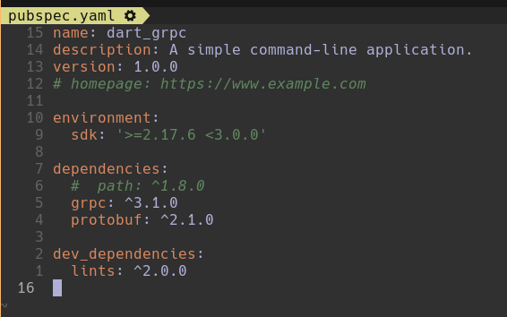
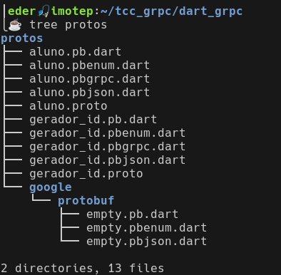
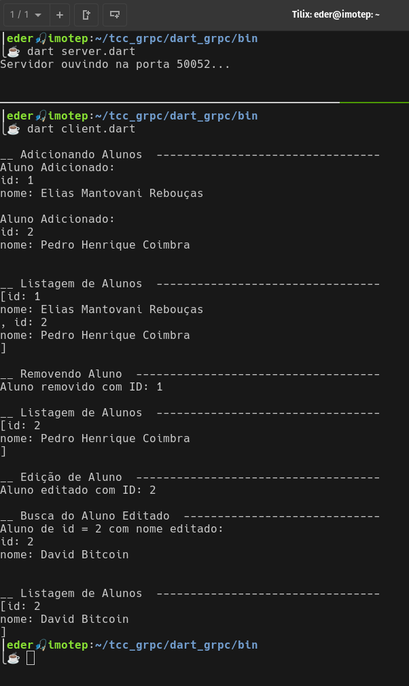
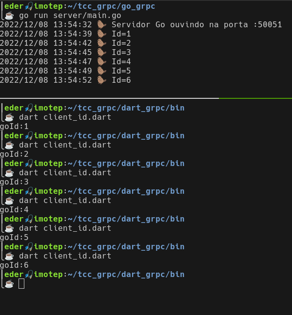

## gRPC no Dart :bird:

Temos as seguintes etapas para fazer:


**[1. asdf](./README.md#)**<br>
[1.1. Instalar o plugin asdf do Dart]()<br>
[1.2. Instalar uma versão do Dart]()<br>

**[2. Dart](./README.md)**<br>
[2.1 Inicializar o projeto](#21-inicializar-o-projeto)<br>
[2.2. Instalar dependências](#22-instalar-depend%C3%AAncias)<br>

**[3. Criar os arquivos](./README.md#3-criando-os-arquivos-serverjs-clientjs-e-o-contrato-sorteioproto)**<br>
[3.1. sorteio.proto](#31-sorteioproto)<br>
[3.2 server.js](#32-serverjs)<br>
[3.3 client.js](#33-clientjs)<br>

**[4. Executar teste](./README.md#4-executar-teste)**

---

📌 Para uma fundamentação teórica e explicação do código, recomendamos a leitura da [Wiki do projeto](https://github.com/earmarques/tcc_grpc/wiki). Aqui vamos cuidar apenas dos comandos para fazer o gRPC funcionar com JavaScript.

---

### 1. asdf

#### 1.1. Instalar o plugin asdf do Dart

```mkdir -p protos;
touch protos/aluno.proto
asdf plugin-add dart https://github.com/patoconnor43/asdf-dart.git
```

#### 1.2. Instalar uma versão do Dart

```
asdf install dart 2.17.6
```

#### 1.3. Tornar a versão global

Faremos da 2.17.6 a versão global para todos os projetos na máquina
```
asdf global dart 2.17.6
```

Checar instalação 
```
dart --version
```
`> Dart SDK version: 2.17.6 (stable) (Tue Jul 12 12:54:37 2022 +0200) on "linux_x64"`

---

### 2. Dart

#### 2.1 Plugin _Protocol Buffer Compiler_

Instalar o plugin do compilador dos arquivos `.proto`. 

```
dart pub global activate protoc_plugin
```

#### 2.2 Atualizar o PATH

Precisamos atualizar o PATH para que o protoc possa encontrar o plugin que acabamos de instalar.

```
export PATH="$PATH":"$HOME/.pub-cache/bin"
```
Estrutura projeto console Dart
Este comando modifica temporariamente o PATH, apenas para o shell que estivermos usando. Se quisermos evitar ter de executarmos o comando anterior toda vez que formos compilar arquivos .proto para o Dart, devemos acrescentar essa linha de comando ao finalCódigo Dart gerado a partir das especificações de serviços . do arquivo ~/.bashrc.

<br>
_Figura 1: Path para o plugin do compilador _protobuff_ no ~/.bashrc_

Nosso shell é bash, executar `source ~/.bashrc` carrregará as novas configurações. Se usa outro shell, feche e abra o terminal novamente.

#### 2.3 Criar uma aplicação de console

Dentro do diretório `tcc_grpc`, execute: 
```
dart create --template=console-simple dart_grpc
```
O comando cria uma aplicação de console no diretório dart_grpc com a estrutura da figura 2.

<br>
_Figura 2: Estrutura projeto console Dart_

#### 2.4. Adicionar dependências

Vamos adicionar duas dependências ao arquivo pubspec.yaml: [`grpc: ^3.1.0`](https://pub.dev/packages/grpc) e [`protobuf: ^2.1.0`](https://pub.dev/packages/protobuf).

- Editar `pubspec.yaml`

<br>
_Figura 3: Dependências no pubspec.yaml_

- Instalar dependências

```
dart pub get
```

### 3. Contratos *.proto

Os arquivos .proto de definições de serviços ficarão no diretório `protos`.

#### 3.1. Arquivos _Protobuff_ 

O Dart consumirá a API Golang, logo, o Dart precisa do mesmo contrato, da mesma interface especificada pelo arquivo [LINK TODO -> gerador_id.proto]() presente no repositório da API Go. A outra definição de serviço é `aluno.proto` onde vamos declarar todas as operações elementares do banco de dados.

```
mkdir -p protos;
cp ../go_grpc/protos/gerador_id.proto protos/ ;
touch protos/aluno.proto
```
O arquivo `aluno.proto` deve estar como na listagem 1.

```proto
// aluno.proto
syntax = "proto3";

import "google/protobuf/empty.proto";

service CrudAlunoService {
    rpc CreateAluno(Aluno) returns (Aluno);
    rpc GetAllAlunos(google.protobuf.Empty) returns (Alunos);
    rpc GetAluno(AlunoId) returns (Aluno);
    rpc DeleteAluno(AlunoId) returns (google.protobuf.Empty) {};
    rpc EditAluno(Aluno) returns (Aluno) {};

}

message AlunoId {
    int32 id = 1;
}

message Aluno {
    int32 id = 1;
    string nome = 2;    
}

message Alunos {
    repeated Aluno alunos = 1;
}
```
_Listagem 1: aluno.proto_


#### 3.2. Compilar os arquivos `.proto` 

Temos três _protobuff_ para compilar, `aluno.proto`, `gerador_id.proto` e o `empty.proto`, que está importado nos dois primeiros, nos quais o usamos como tipo de `message` para procedimentos que não recebem argumentos, como em `CrudAlunoService#GetAllAlunos` e `GeradorID#GerarId`, ou nos procedimentos que retornam vazio (`void`), como em `CrudAlunoService#DeleteAluno`.

Na pasta `dart_grpc`, compile os arquivos com o comando:

```
protoc -I=protos/ --dart_out=grpc:protos/ \
protos/aluno.proto \
protos/gerador_id.proto \
google/protobuf/empty.proto
```
Teremos os vários códigos `.dart` gerados da figura 4.

<br>
_Figura 4: Códigos Dart gerados a partir das especificações de serviços .proto_

---

### 4. Códigos cliente e servidor

Vamos fazer uma abordagem cautelosa cartesiana - análise e síntese, conquistando passo a passo cada recurso de que precisamos para depois formarmos o todo. Primeiro vamos fazer um cliente-servidor apenas 
em Dart do nosso `CrudAlunoService` (`client.dart` e `server.dart`). Depois vamos fazer um cliente Dart consumir o `service` Golang `GeradorID` (`client_id.dart`). Por fim, vamos fazer um cliente-servidor Dart cujo servidor de serviço é por sua vez cliente de outro serviço em Golang (`server_cliente_go.dart` e `cliente_id_go.dart`). Esses códigos .dart estarão aCódigo Dart gerado a partir das especificações de serviços .brigados na pasta `dart_grpc/bin`.    

#### 4.1. _Microservice_ `CrudAlunoService`

Nosso banco de dados é emulado (_mock_) com uma lista em memória: `Alunos lista = Alunos();`. Em `#createAluno` o `id` do aluno já deve vir fornecido no objeto `request`. Posteriormente esse id será gerado pelo microserviço em Golang.

##### 4.1.1 server.dart

```dart
import 'package:grpc/grpc.dart';
import '../protos/aluno.pbgrpc.dart';
import '../protos/google/protobuf/empty.pb.dart';


class CrudAlunoService extends CrudAlunoServiceBase {
  Alunos lista = Alunos();

  @override
  Future<Aluno> createAluno(ServiceCall call, Aluno request) async {
    var aluno = Aluno();
    aluno.nome = request.nome;
    aluno.id = request.id;
    lista.alunos.add(aluno);
    return aluno;
  }

  @override
  Future<Alunos> getAllAlunos(ServiceCall call, Empty request) async {
    return lista;
  }

  @override
  Future<Aluno> getAluno(ServiceCall call, AlunoId request) async {
    var aluno = lista.alunos.firstWhere((aluno) => aluno.id == request.id);
    return aluno;
  }

  @override
  Future<Empty> deleteAluno(ServiceCall call, AlunoId request) async {
    lista.alunos.removeWhere((aluno) => aluno.id == request.id);
    return Empty();
  }

  @override
  Future<Aluno> editAluno(ServiceCall call, Aluno request) async {
    var aluno = lista.alunos.firstWhere((aluno) => aluno.id == request.id);
    aluno.nome = request.nome;
    return aluno;
  }
}

Future<void> main(List<String> args) async {
  final server = Server(
    [CrudAlunoService()],
    const <Interceptor>[],
    CodecRegistry(codecs: const [GzipCodec(), IdentityCodec()]),
  );
  await server.serve(port: 50052);
  print('Servidor ouvindo na porta ${server.port}...');
}
```
_Listagem 2: server.dart_

##### 4.1.2 client.dart

Na classe `Client` criamos o canal de comunicação `channel` e o objeto `stub` que representa no cliente o serviço oferecido pelo servidor, pelo qual faremos as chamadas remotas. Inicialmente criamos dois objetos alunos, passando o id manualmente, e depois testamos todas as _remote procedure calls_.  

```dart
import 'package:grpc/grpc.dart';
import './../protos/aluno.pbgrpc.dart';
import '../protos/google/protobuf/empty.pb.dart';

class Client {
  late ClientChannel channel;
  late CrudAlunoServiceClient stub;

  Future<void> main(List<String> args) async {
    channel = ClientChannel('localhost',
        port: 50052,
        options: // Aqui não teremos credenciais
            const ChannelOptions(credentials: ChannelCredentials.insecure()));
    stub = CrudAlunoServiceClient(channel,
        options: CallOptions(timeout: Duration(seconds: 30)));
    try {
      //...
      print('\n__ Adicionando Alunos  ---------------------------------');
      var alunoToAdd1 = Aluno();
      alunoToAdd1.id = 1;
      alunoToAdd1.nome = "Elias Mantovani Rebouças";
      var alunoAdicionado1 = await stub.createAluno(alunoToAdd1);
      print("Aluno Adicionado:\n" + alunoAdicionado1.toString());

      var alunoToAdd2 = Aluno();
      alunoToAdd2.id = 2;
      alunoToAdd2.nome = "Pedro Henrique Coimbra";
      var alunoAdicionado2 = await stub.createAluno(alunoToAdd2);
      print("Aluno Adicionado:\n" + alunoAdicionado2.toString());

      print('\n__ Listagem de Alunos  ---------------------------------');
      var todosAlunos = await stub.getAllAlunos(Empty());
      print(todosAlunos.alunos.toString());

      print('\n__ Removendo Aluno  ------------------------------------');
      var alunoToDel = AlunoId();
      alunoToDel.id = 1;
      await stub.deleteAluno(alunoToDel);
      print("Aluno removido com ID: " + alunoToDel.id.toString());

      print('\n__ Listagem de Alunos  ---------------------------------');
      var todosAlunos2 = await stub.getAllAlunos(Empty());
      print(todosAlunos2.alunos);

      print('\n__ Edição de Aluno  ------------------------------------');
      var alunoToEdit = Aluno();
      alunoToEdit.id = 2;
      alunoToEdit.nome = "David Bitcoin";
      await stub.editAluno(alunoToEdit);
      print("Aluno editado com ID: " + alunoToEdit.id.toString());


      print('\n__ Busca do Aluno Editado  -----------------------------');
      var alunoToGet = AlunoId();
      alunoToGet.id = 2;
      var alunoObtido = await stub.getAluno(alunoToGet);
      print("Aluno de id = 2 com nome editado:\n" + alunoObtido.toString());

      print('\n__ Listagem de Alunos  ---------------------------------');
      var todosAlunos3 = await stub.getAllAlunos(Empty());
      print(todosAlunos3.alunos);

    }
    catch (e) {
      print('\n\nErro: O Servidor está offline\n');
      print(e);
    }
    await channel.shutdown();
  }
}

main() {
  var client = Client();
  client.main([]);
}
```
_Listagem 3: client.dart_

##### 4.1.2 Teste CRUD banco de dados Dart

Precisamos de dois terminais, um para o servidor do banco e outro para o cliente testar. Dentro do diretório bin:
- terminal do servidor

```
dart server.dart
```
- terminal do cliente

```
dart client.dart
```

Com êxito, teremos o resultado mostrado na figura 5.

<br>
_Figura 5: Banco de dados Dart_


#### 4.2. _Microservice_ `GeradorID`

O segundo recurso que precisamos é fazer um cliente Dart consumir o microserviço Golang de gerar o índice incremental para ser nossa chave pimária do banco Dart. Para isso vamos escrever apenas o código necessário para se comunicar com a API Golang, `client_id.dart`.


```dart
import 'package:grpc/grpc.dart';
import './../protos/gerador_id.pbgrpc.dart';
import '../protos/google/protobuf/empty.pb.dart';

class Client {
  late ClientChannel channel;
  late GeradorIDClient stub;

  Future<void> main(List<String> args) async {
    channel = ClientChannel('localhost',
        port: 50051,
        options: // Aqui não teremos credenciais
            const ChannelOptions(credentials: ChannelCredentials.insecure()));
    stub = GeradorIDClient(channel,
        options: CallOptions(timeout: Duration(seconds: 30)));
    try {
      //...
      var id = await stub.gerarId(Empty());
      print('goId:${id.goId}');
      
    } catch (e) {
      print('\n\nErro: O Servidor está offline\n');
      print(e);
    }
    await channel.shutdown();
  }
}

main() {
  var client = Client();
  client.main([]);
}
```
_Listagem 4: client_id.dart_

Agora em um shell vamos até o diretório do Golang inicializar o servidor.

```
cd ../../go_grpc/ ;
go run server/main.go
```

E faremos várias chamadas para testar a comunicação da aplicação Dart com o microserviço Golang. Dentro do diretório `dart_grpc/bin`, executamos o `client_id.dart`. 

```
dart client_id.dart
```

Na figura 6 vemos no shell superior o microserviço Golang servindo na porta 50051 e na shell inferior a aplicação cliente Dart imprimindo o id gerado pelo servidor Golang.

<br>
_Figura 6: Aplicação Dart comsumindo microserviço Golang_

#### 4.3. _Microservices_ `CrudAlunoService` com `GeradorID`


<br><br>

[:arrow_up: Topo](#grpc-no-nodejs-green_apple)

<br><br>
