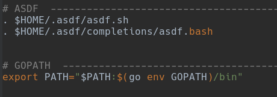
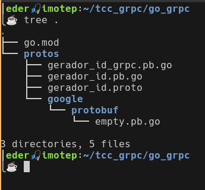
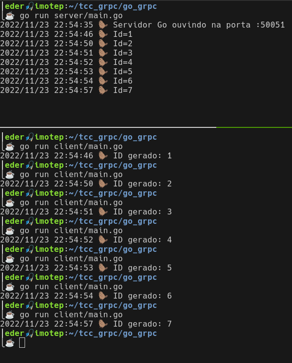

## gRPC no Golang 🦫

No Golang a configuração é mais burocrática que no JavaScript.

**[1. asdf](./README.md#1-asdf)**<br>
[1.1. Protocol Buffer Compile](#11-protocol-buffer-compiler)<br>
[1.1.1. Instalar o plugin](#111-instalar-o-plugin)<br>
[1.1.2. Instalar a versão](#112-instalar-a-vers%C3%A3o)<br>
[1.2. Golang](#12-golang)<br>
[1.2.1. Instalar o plugin](#121-instalar-o-plugin)<br>
[1.2.2. Instalar uma versão do Golang](#122-instalar-uma-vers%C3%A3o-do-golang)<br>

**[2. Golang](./README.md#2-golang)**<br>
[2.1. Plugins Go](#21-plugins-go)<br>
[2.2. Atualizar PATH](#22-atualizar-path)<br>
[2.3. Inicializar o projeto](#23-inicializar-o-projeto)<br>
[2.4. Instalar a dependência grpc-go](#24-instalar-o-pacote-grpc-go)<br>
[2.5. Reshim](#25-reshim)<br>

**[3. Criar os arquivos](./README.md#3-criar-os-arquivos)**<br>
[3.1. Arquivo _Protobuf_](#31-arquivo-_protobuf_)<br>
[3.2. Compilar o arquivo proto](#32-compilar-o-arquivo-proto)<br>
[3.3. Server](#33-server)<br>
[3.4. Client](#34-client)<br>

**[4. Executar teste](./README.md#4-executar-teste)**

---

:pushpin: Para uma fundamentação teórica e explicação do código, recomendamos a leitura da [Wiki do projeto](https://github.com/earmarques/tcc_grpc/wiki). Aqui vamos cuidar apenas dos comandos para fazer o gRPC funcionar Golang.

---


### 1. asdf

Podemos encontrar o plugin de qualquer linguagem procurando no google por: _asdf plugin `nomeDaLinguagem`_. Entrar no github do plugin e seguir as instruções. Fizemos isso para o `golang`e o compilador protoc

#### 1.1. _Protocol Buffer Compiler_

Para compilar um arquivo `protocol buffer`, nós precisamos instalar o compilador e depois os plugins específicos da linguagem golang. O _protocol buffer compiler_ usaremos o asdf para instalá-lo.

##### 1.1.1. Instalar o plugin 
```
asdf plugin-add protoc https://github.com/paxosglobal/asdf-protoc.gitEstrutura do projeto
```
##### 1.1.2. Instalar a versão 

```
asdf install protoc 3.20.3
```

#### 1.2. Golang
##### 1.2.1. Instalar o plugin
```
asdf plugin-add golang https://github.com/kennyp/asdf-golang.git
```

##### 1.2.2. Instalar uma versão do Golang
<br>
Podemos ver todas as versões disponíveis com:
```
asdf list all golang
```

Intalamos a versão 1.19:E
```
asdf install golang 1.19
```

---

### 2. Golang

#### 2.1. Plugins Gohttps://github.com/earmarques/tcc_grpc/blob/main/go_grpc/README.md#grpc-no-golang-

Um dos grandes benefícios do gRPC é o fato dele gerar códigos que abstraem e cuidam de toda a comunicação pela rede. Para tanto, cada linguagem tem plugins específicos. No caso do Golang, precisamos instalar dois plugins para gerar códigos para nós a partir dos arquivos _.proto_.
```
go install google.golang.org/protobuf/cmd/protoc-gen-go@v1.28.1
```
```
go install google.golang.org/grpc/cmd/protoc-gen-go-grpc@v1.2
```

#### 2.2. Atualizar PATH

Precisamos atualizar o PATH para incluir os pacotes baixados do Golang, para que o `protoc` possa encontrar os plugins que acabamos de instalar.
```sh
export PATH="$PATH:$(go entouch sorteio.proto server.js client.jsv GOPATH)/bin"
```
Este comando modifica temporariamente o PATH, apenas para o shell que estivermos usando. Se quisermos evitar ter de executarmos o comando anterior toda vez que formos compilar arquivos _.proto_ em Go, então devemos acrescentar a linha de comando ao final do arquivo `~/.bashrc`.

<br>
_Figura 1: GOPATH no ~/.bashrc_

Nosso shell é bash, executar `source ~/.bashrc` carrregará as novas configurações. Se usa outro shell, feche e abra o terminal novamente. 

#### 2.3. Inicializar o projeto

Estando dentro do diretóriotouch sorteio.proto server.js client.js tcc_grpc/ execute os comandos para criar o diretório do go e entrar nele.

```
mkdir go_grpc; cd go_grpc;<br>
```

O comando `go mod init` cria um arquivo `go.mod` e rastreia as dependências do projeto. Nós chamaremos nosso módulo como o subrepositório do tcc: `go mod init github.com/earmarques/tcc_grpc/go_grpc`, mas recomendamos ao leitor usar o seu próprio git, ou um nome qualquer, como:

```
go mod init meu_modulo_grpc
```

#### 2.4. Instalar o pacote ***`grpc-go`***

Por fim, agora que o projeto está sendo monitoErado, vamos instalar a dependência `grpc-go`.
```
go get google.golang.org/grpc
```

#### 2.5 Reshim

A documentação do [plugin](https://github.com/kennyp/asdf-golang#when-using-go-get-or-go-install) asdf do golang recomenda fazer um _reshim_ toda vez que fizermos um `go get` ou `go install`, então, por prudência:
```
asdf reshim golang
```
---

### 3. Criar os arquivos

Vamos organizar os arquivos em pastas separadas, uma para arquivos _.proto_, outra para o servidor e outra para o cliente.

#### 3.1. Arquivo _Protobuf_

Criamos a pasta _protos_ e touch sorteio.proto server.js client.jsnela o arquivo `gerador_id.proto`:

```
mkdir protos; 
touch protos/gerador_id.proto;
```
Editamos o arquivo para ter o conteúdo:

```proto
// gerador_id.prototouch sorteio.proto server.js client.js

syntax = "proto3";

import "google/protobuf/empty.proto";

option go_package = "github.com/earmarques/tcc_grpc/go_grpc";
package geradorid;

service GeradorID {
    rpc GerarId(google.protobuf.Empty) returns (IdReply) {}
}

message IdReply {
    int32 goId = 1;
}
``` 
_Listagem 1: protos/gerador_id.proto_

#### 3.2. Compilar o arquivo proto

Estando no diretório `protos/`, execute:
```
protoc --go_out=. --go_opt=paths=source_relative \
--go-grpc_out=. --go-grpc_opt=paths=source_relative \
 google/protobuf/empty.proto gerador_id.proto
```
Chamamos o compilador `protoc` que usará os plugins do Go para gerar o código. No arquivo `gerador_id.proto` nós ihttps://github.com/earmarques/tcc_grpc/blob/main/go_grpc/README.md#grpc-no-golang-mportamos a definição Estrutura do projetode tipo vazio (`empty.proto`). Em definições de contrato, se uma chamada de procedimento remota `rpc` não recebe nenhum parâmetro como argumento, ou retorna `void`, ainda assim, devemos definir esse tipo `message`. Como isso é uma `message` muito recorrente, é bom que tenhamos uma definição comum ao invés de definí-la em cada arquivo _.proto_, e termos problemas de conflito de declaração. Sendo assim, nós importamos de `google/protobuf/empty.proto`.

Veremos dois arquivos `.go` criados na pasta _protos_, `gerador_id_grpc.pb.go` e `gerador_id.pb.go`. Também foi criada uma pasta _google_ referente à importação, com outro código gerado pelos plugins, `empty.pb.go`. A figura 2 mostra como deve ser a estrutura do módulo go_grpc.

<br>
_Figura 2: Estrutura do projeto_


#### 3.3. Server

Criar a pasta do servidor e o seu código.
```
mkdir server;
touch server/main.go
```

```go
// server/main.go

package main

import (
	"context"
	"log"https://github.com/earmarques/tcc_grpc/blob/main/go_grpc/README.md#grpc-no-golang-
	"net"

	"google.golang.org/grpc"

	pb "github.com/earmarques/tcc_grpc/go_grpc/protos"
	emptypb "google.golang.org/protobuf/types/known/emptypb"
)

const (
	port = ":50051"
)

var id int32 = 0

// Stub
type server struct {
	pb.UnimplementedGeradorIDServer
}

// Implementação do método
func (s *server) GerarId(ctx context.Context, in *emptypb.Empty) (*pb.IdReply, error) {
	id++
	log.Printf("🦫 Id=%d", id)
	return &pb.IdReply{GoId: id}, nil
}

func main() {
	// Canal gRPC
	lis, err := net.Listen("tcp", port)
	if err != nil {
		log.Fatalf("Falha ao escutar a conexão: %v", err)
	}
	// Instancia o servidor
	s := grpc.NewServer()
	pb.RegisterGeradorIDServer(s, &server{})

	log.Printf("🦫 Servidor Go ouvindo na porta %s", port)

	if err := s.Serve(lis); err != nil {
		log.Fatalf("Falha ao prestar o serviço: %v", err)
	}
}

``` 
_Listagem 2: server/main.go_

#### 3.4 Client
Vamos criar um código de teste para consumir o serviço `GeradorID` e checar se o servidor está respondendo.

Criar a pasta do cliente e o código.
```
mkdir client;
touch client/main.go
```

```go
// client/main.go

package main

import (
	"context"
	"log"
	"time"

	"google.golang.org/grpc"

	pb "github.com/earmarques/tcc_grpc/go_grpc/protos"
	emptypb "google.golang.org/protobuf/types/known/emptypb"
)

const (
	address = "localhost:50051"
)

func main() {
	// Set up a connection to the server.
	conn, err := grpc.Dial(address, grpc.WithInsecure(), grpc.WithBlock())
	if err != nil {
		log.Fatalf("Não foi possível estabelecer conexão com o servidor gRPC: %v", err)
	}
	defer conn.Close()
	c := pb.NewGeradorIDClient(conn)

	ctx, cancel := context.WithTimeout(context.Background(), time.Second)
	defer cancel()
	r, err := c.GerarId(ctx, &emptypb.Empty{})
	if err != nil {
		log.Fatalf("Não foi possível gEerar o id: %v", err)
	}
	var id = r.GetGoId()
	log.Printf("🦫 ID gerado: %d", id)
	//log.Printf("Não foi possível gerar o id: %v", r)
}https://github.com/earmarques/tcc_grpc/blob/main/go_grpc/README.md#grpc-no-golang-

```
_Listagem 3: client/main.go_

---

### 4. Executar teste

Vamos precisar de dois terminais, em um deixaremos o servidor ouvindo na porta 50051, no outro executamos as chamadas remotas. O comportamento esperado é dado na figEstrutura do projetoura 3.https://github.com/earmarques/tcc_grpc/blob/main/go_grpc/README.md#grpc-no-golang-

<br>
_Figura 3: Teste de comunicação cliente-servidor Golang_
Estrutura do projeto

<br><br>

[ :arrow_up: Topo](https://github.com/earmarques/tcc_grpc/blob/main/go_grpc/README.md#grpc-no-golang-)

<br><br>


