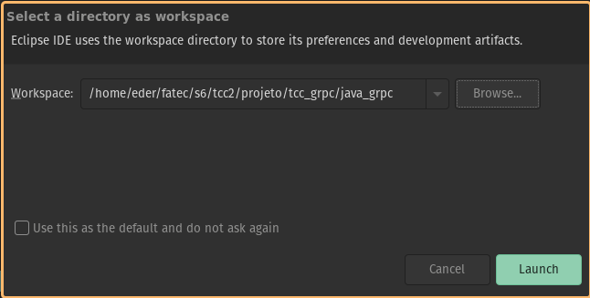
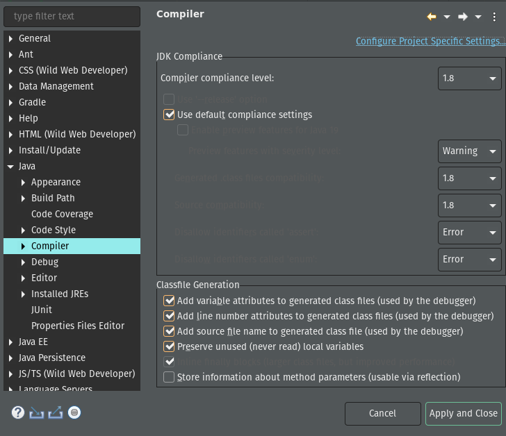
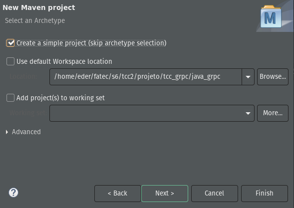
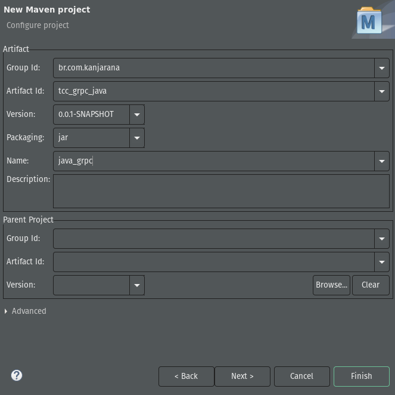
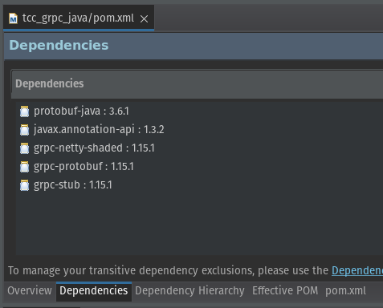
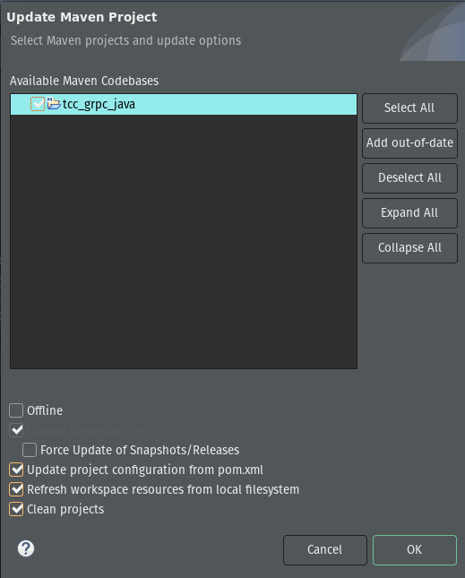
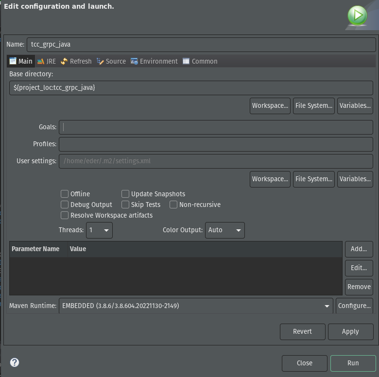

## gRPC no Java :coffee:

Temos as seguintes etapas para fazer:


**[1. asdf](./README.md#1-asdf)**<br>
[1.1. Instalar o plugin asdf do NodeJS](#11-instalar-o-plugin-asdf-do-nodejs)<br>
[1.2. Instalar uma versão do NodeJS](#12-instalar-uma-vers%C3%A3o-do-nodejs)<br>

**[2. NodeJS](./README.md#2-nodejs)**<br>
[2.1 Inicializar o projeto](#21-inicializar-o-projeto)<br>
[2.2. Instalar dependências](#22-instalar-depend%C3%AAncias)<br>

**[3. Criar os arquivos](./README.md#3-criando-os-arquivos-serverjs-clientjs-e-o-contrato-sorteioproto)**<br>
[3.1. sorteio.proto](#31-sorteioproto)<br>
[3.2 server.js](#32-serverjs)<br>
[3.3 client.js](#33-clientjs)<br>

**[4. Executar teste](./README.md#4-executar-teste)**

---

📌 Para uma fundamentação teórica e explicação do código, recomendamos a leitura da [Wiki do projeto](https://github.com/earmarques/tcc_grpc/wiki). 
Aqui vamos cuidar apenas de fazer o gRPC funcionar com o Java.

---

### 1. Eclipse

Em nossas pesquisas sobre gRPC no Java, todos os autores que encontramos usavam alguma ferramenta gráfica com um dos dois gerenciadores de dependências Java, Maven ou Gradle.
O mais recorrente e que nos pareceu mais simples, talvez pela nossa familiaridade com a ferramenta, foi o Eclipse IDE. Portanto, não vamos usar o NeoVim e o asdf, vamos utilizar o Eclipse com o Maven.

#### 1.1. Instalar o Eclipse


Instalar o Eclipse não tem segredo. Pode utilizar o gerenciador de aplicativos da sua distribuição linux ou [baixar do site](https://www.eclipse.org/downloads/) o instalador caso use Windows. Nós optamos por baixar o arquivo `eclipse-inst-jre-linux64.tar.gz`. É preciso descompactar este arquivo. Haverá dentro do diretório `eclipse-installer/` o arquivo **`eclipse-inst`** que deve ser executado. Se tiver problemas de permissão, clique com botão da direita, selecione Propriedades e dê permissão de execução, ou então no terminal, digite: `chmod +x eclipse-inst`. Nós instalamos a versão para Web 4.26.0. 

#### 1.2. Configurar o Eclipse

Ao abrirmos o Eclipse, ele questiona pelo diretório _workspace_, onde ficará os arquivos de configuração, de códigos e tudo mais pertinente aos projetos. Podemos centralizar em um único ou podemos ter vários _workspaces_. Nós preferimos a segunda opção, e além do mais, no nosso caso, temos o diretório `tcc_grpc` com subdiretórios para cada API, então vamos criar o subdiretório `java_grpc` para ser o _workspace_ do gRPC. Na figura 1 vemos o caminho completo onde será criado nosso projeto Maven. 

<br>
_Figura 2: Workspace gRPC_

Nós gostamos da versão do Java 8, e vamos configurar a IDE Eclipse para usar essa versão em todos os projetos que criarmos, isto é, será a versão _default_ da IDE. É possível configurar uma versão específica para o Java para cada projeto. Nessa instalação do Eclipse já foi instalado várias versões, até a versão 19. Na barra superior do menu, fomos em `Window` >> `Preferences`. Na janela _pop-up_, navegamos `Java` >> `Compiler`, em `Compiler compliance lever`, selecionamos `1.8` e clicamos em `Apply and Close`, como na figura 2. 

<br>
_Figura 2: Versão Java 8_

### 2. Projeto Maven Java java_maven_build.png

#### 2.1. Criar Projeto

Nós precisamos de um projeto com o gerenciador de dependências Maven. No menu, `File` >> `New` >> `Other...`, _pop-up_ `Maven` >> `Maven Project` >> `Next`. Não esquecer de marcar a opção `Create a simple project` como está na figura 3.

<br>
_Figura 3: Projeto Maven simples_

Para este projeto Maven, nós demos as identificações de artefato mostradas na figura 4. 

<br>
_Figura 4: Artefato do projeto Maven_

#### 2.2. Configurar Projeto

Precisamos fazer algumas configurações no projeto para que possomos trabalhar com o gRPC. Para tanto, devemos editar o arquivo pom.xml para ficar como na listagem 1. 

```xml
<project xmlns="http://maven.apache.org/POM/4.0.0" 
         xmlns:xsi="http://www.w3.org/2001/XMLSchema-instance" 
         xsi:schemaLocation="http://maven.apache.org/POM/4.0.0 https://maven.apache.org/xsd/maven-4.0.0.xsd">
	<modelVersion>4.0.0</modelVersion>
	<groupId>br.com.kanjarana</groupId>
	<artifactId>tcc_grpc_java</artifactId>
	<version>0.0.1-SNAPSHOT</version>
	<name>java_grpc</name>
	
	<dependencies>
		<dependency>
			<groupId>com.google.protobuf</groupId>
			<artifactId>protobuf-java</artifactId>
			<version>3.6.1</version>
		</dependency>
		<dependency>
			<groupId>javax.annotation</groupId>
			<artifactId>javax.annotation-api</artifactId>
			<version>1.3.2</version>
		</dependency>
		<dependency>
			<groupId>io.grpc</groupId>
			<artifactId>grpc-netty-shaded</artifactId>
			<version>1.15.1</version>
		</dependency>
		<dependency>
			<groupId>io.grpc</groupId>
			<artifactId>grpc-protobuf</artifactId>
			<version>1.15.1</version>
		</dependency>
		<dependency>
			<groupId>io.grpc</groupId>
			<artifactId>grpc-stub</artifactId>
			<version>1.15.1</version>
		</dependency>
	</dependencies>
	
	<properties>
		<project.build.sourceEncoding>UTF-8</project.build.sourceEncoding>
	</properties>
	
	<build>
		<defaultGoal>clean generate-sources compile install</defaultGoal>
		<plugins>
			<!-- compile proto file into java files. -->
			<plugin>
				<groupId>com.github.os72</groupId>
				<artifactId>protoc-jar-maven-plugin</artifactId>
				<version>3.6.0.1</version>
				<executions>
					<execution>
						<phase>generate-sources</phase>
						<goals>
							<goal>run</goal>
						</goals>
						<configuration>
							<includeMavenTypes>direct</includeMavenTypes>
							
							<inputDirectories>
								<include>src/main/resources</include>
							</inputDirectories>
							
							<outputTargets>
								<outputTarget>
									<type>java</type>
									<outputDirectory>src/main/java</outputDirectory>
								</outputTarget>
								
								<outputTarget>
									<type>grpc-java</type>
									<pluginArtifact>io.grpc:protoc-gen-grpc-java:1.15.0</pluginArtifact>
									<outputDirectory>src/main/java</outputDirectory>
								</outputTarget>
							</outputTargets>
							
						</configuration>
					</execution>
				</executions>
			</plugin>
			
			<plugin>
				<groupId>org.apache.maven.plugins</groupId>
				<artifactId>maven-compiler-plugin</artifactId>
				<version>3.8.0</version>
				<configuration>
					<source>1.8</source>
					<target>1.8</target>
				</configuration>
			</plugin>
		</plugins>
	</build>
</project>

```

No início do arquivo de configuração do projeto (`pom.xml`) temos as dependências aos artefatos necessários ao gRPC (figura 5).

<br>
_Figura 5: Dependências gRPC_

Temos na sequência a proriedade UTF-8, e logo a seguir, a configuração do comportamento padrão quando fizermos o _Maven-build_. No escopo dos _plugins_, podemos ver artefato e a versão do compilador _protobuf_java_maven_build.png que iremos usar. Na tag `inputDirectories` está a localização dos arquivos `.proto`, no caso em `src/main/resources`. O destino dos códigos gerados pelo _framework_ gRPC (_tag_ `outputTargets`) vai depender do tipo, os `java` vão parar em `src/main/java` e os tipo `grpc-java` para a pasta `src/main/java_grpc`. O último _plugin_ é do próprio Maven, onde é informada a versão Java 8 para o projeto.

Salvado o `pom.xml`, clicamos com botão direto no projeto em `Package Explorer` para abrir um menu, vamos em `Maven` >> `Update Project...` (atalho Alt F5), selecionamos o projeto e em `Ok` (figura 6).

<br>
_Figura 6: Atualizar projeto após edição do pom.xml_

Em seguida, vamos construir o projeto e verificar se está tudo certo.  Novamente, botão direto sobre o projeto, `Run As` >> `Maven build`. Irá abrir a janela da figura 7. Como nós já definimos no `pom.xml` o comportamento padrão do `Maven-build`, podemos deixar o campo `Goals` vazio e clicar em `Run`.

<br>
_Figura 7: Maven build_

Na primeira vez, o Maven vai baixar e instalar as dependências. Se tudo correr bem, teremos como resultado a saída no Console da figura 8.

<br>
_Figura 8: Projeto construído com sucesso_


