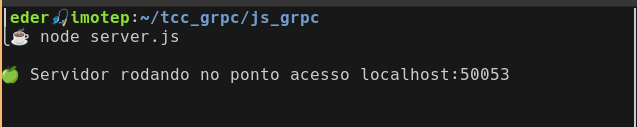
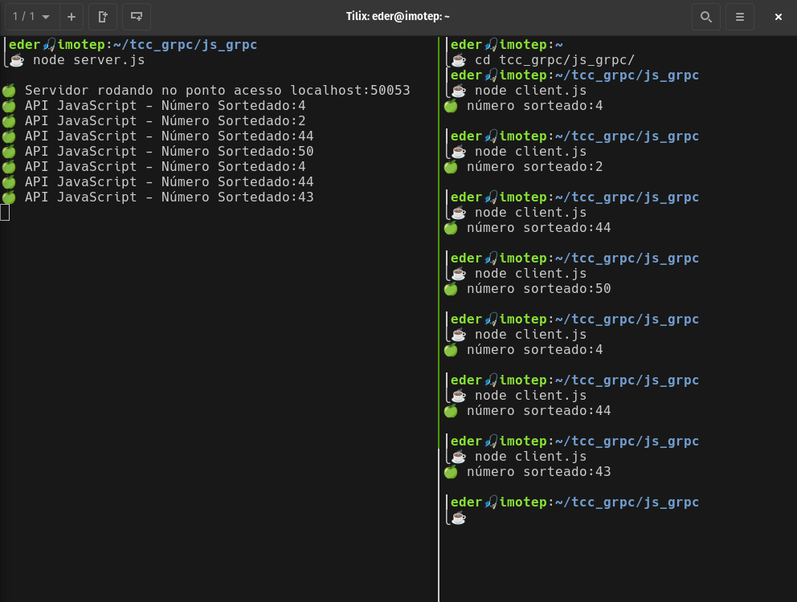

### asdf
Estando dentro da pasta tcc_grpc/js_grpc/, execute os comandos.

#### Instalar o plugin asdf do Node

```
asdf plugin add nodejs https://github.com/asdf-vm/asdf-nodejs.git
```

#### Instalar uma versão do NodeJS

Nós estamos usando a versão 18.7.0 do NodeJS. Para evitar problemas, recomendamos usar a mesma versão. 

```
asdf install nodejs 18.7.0
```

> Se quiser instalar a versão mais recente o comando é:
> ```
> asdf install nodejs latest
> ```
> Poderá ter qualquer versão disponível entre as listadas:
> ```
> asdf list all nodejs
> ```
> Poderá configurar a última versão globalmente, como versão default:
> ```
> asdf global nodejs latest
> ```

Mas aqui nós vamos utilizar localmente(tcc_grpc/js_grpc/) neste repositório a versão específica.
```
asdf local nodejs 18.7.0
```

### NodeJS

O NodeJS traz a reboque em seu binário o gerenciador de pacotes npm. Primeiro precisamos inicializá-lo.
```
npm init -y
```

Nós vamos precisar de duas bibliotecas, vamos pedir para o npm buscá-las para nós.

- **@grpc/grpc-js**
```
npm i @grpc/grpc-js
```
- **@grpc/proto-loader**
```
npm i @grpc/proto-loader
```

### Criando os arquivos

Vamos criar os três arquivos que iremos precisar.

```
touch sorteio.proto server.js client.js
```

Vamos editar os arquivos para que fiquem como nas listagens 1, 2 e 3.

```proto
//sorteio.proto
syntax = "proto3";

option java_package = "com.java_grpc";

service SorteioService {
  rpc SortearNumero (IntervaloRequest) returns (SorteadoResponse) {}
}

message IntervaloRequest {
  int32 min = 1;
  int32 max = 2;
}

message SorteadoResponse {
  int32 numero = 1;
}

```
_Listagem 1: sorteio.proto_


```js
// server.js
const grpc = require("@grpc/grpc-js");
const protoLoader = require("@grpc/proto-loader");
const PROTO_PATH = "./sorteio.proto";

const protoObject = protoLoader.loadSync(PROTO_PATH);
const sorteioDefinition = grpc.loadPackageDefinition(protoObject);
const SorteioService = sorteioDefinition.SorteioService;

const server = new grpc.Server();
server.addService(SorteioService.service, {sortearNumero});


function sortearNumero({ request:{min, max} }, callback) {
  let sorteado = bingo(min, max);
  sorteadoResponse = {numero: sorteado};
  console.log('🍏 API JavaScript - Número Sortedado:' + sorteado);
  return callback(null, sorteadoResponse);
}

function bingo(min, max) {
  return Math.floor( Math.random() * (max - min + 1) ) + min;
};

const endereco = 'localhost';
const porta = '50053';
const pontoAcesso = endereco + ':' + porta;

server.bindAsync(
  pontoAcesso,
  grpc.ServerCredentials.createInsecure(),
  (error, port) => {
    console.log("\n🍏 Servidor rodando no ponto acesso " + pontoAcesso);
    server.start();
  }
  );
```
_Listagem 2: server.js_


```js
// client.js
const grpc = require("@grpc/grpc-js");
const protoLoader = require("@grpc/proto-loader");
const PROTO_PATH = "./sorteio.proto";
const packageDefinition = protoLoader.loadSync(PROTO_PATH);
const sorteioStub = grpc.loadPackageDefinition(packageDefinition);
const SorteioService = sorteioStub.SorteioService;
const endereco = 'localhost';
const porta = '50053';
const pontoAcesso = endereco + ':' + porta;

const client = new SorteioService(
  pontoAcesso,
  grpc.credentials.createInsecure()
);

let intervaloRequest = {min: 0, max:50}
Aplicação cliente consumindo microserviço e servidor respondendo às requisições com gRPC
client.sortearNumero(intervaloRequest, (error, responseSorteado) => {  
  if (!error) {
    //console.log("Sucesso!!!");
    let msg = responseSorteado.numero;
    console.log('🍏 número sorteado:' + msg.toString() + '\n');
  }else {
    console.log(error);
  }
});
```
_Listagem 3: client.js_

Vamos subir o servidor com o comando:
```
node server.js
```
Veremos o servidor escutando requisições na porta 50053.

<br>
_Figura 1: Servidor NodeJS gRPC ouvindo na porta 50053_

Deixaremos o servidor escutando em um terminal e abriremos outro, no mesmo diretório, para executar o client.js que irá consumir a API.

```Aplicação cliente consumindo microserviço e servidor respondendo às requisições com gRPC
node server.js
```

A cada execução do comando acima, a aplicação cliente JS envia uma requisição para o servidor usando o _framework_ gRPC. O servidor gera um número entre 0 e 50 e o envia para a aplicação cliente, que recebe o valor e imprime na tela.  

<br>
_Figura 2: Aplicação cliente e servidor se comunicando através do framework gRPC_


